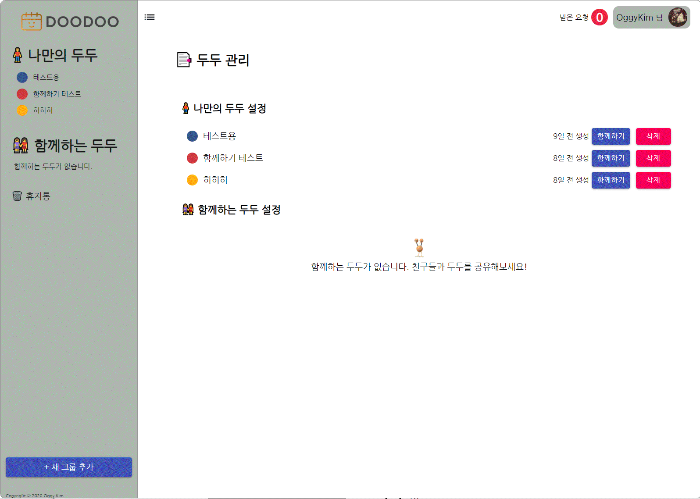

# To-do Management Application(DOODOO)

> Web application(React.js + Express.js)

## Introduction

**DOODOO** is a web application about to-do management. In this site, we can provide individual to-do management lists, and these lists also can be shared to other user.
Each member can use own nickname, profile pic.

## Detail

### Manage To-do

In DOODOO site, user can create your own doodoo list. User can create until 10 list, 20 items in each list. User can easily create and delete new lists and items.

### Share To-do list

DOODOO provides sharing function. If you want to share your items to other user, just search user's nickname! When other user receive your request, they can accept or reject your request. When the request is accepted, two users can share one to-do list.

### SNS Login, and etc,.

Welcome, and _DO YOUR TO-DO LIST WITH DOODOO_!

## Project stack

_Client-side_

- React.js
- Redux.js + Hook
- Material-ui
- HTML5 + CSS3 + ES6+ Javascript

_Server-side_

- Express.js
- MongoDB(Atlas cloud)

_Deployment_

- Docker
- AWS Beanstalk + S3
